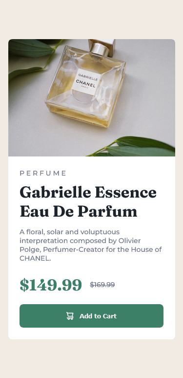
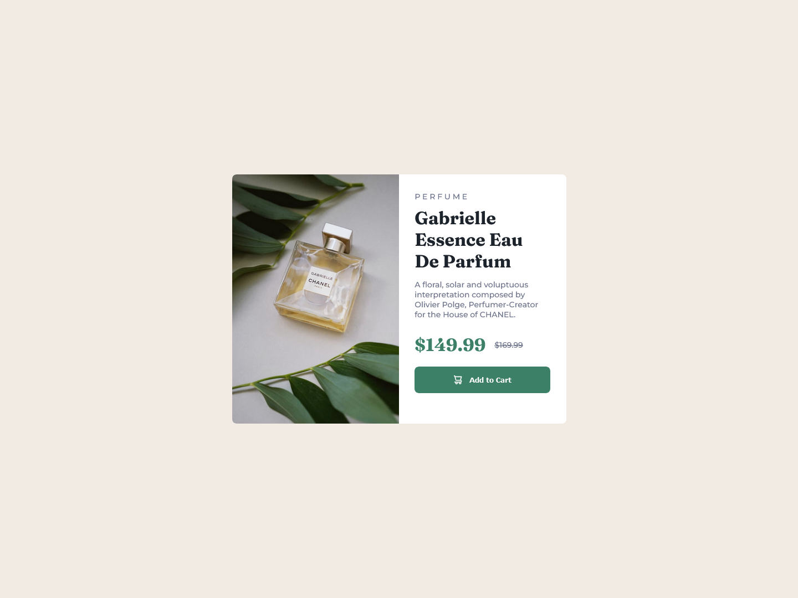

# Frontend Mentor - Product preview card component solution

This is a solution to the [Product preview card component challenge on Frontend Mentor](https://www.frontendmentor.io/challenges/product-preview-card-component-GO7UmttRfa). Frontend Mentor challenges help you improve your coding skills by building realistic projects. 

## Table of contents

- [Overview](#overview)
  - [The challenge](#the-challenge)
  - [Screenshot](#screenshot)
  - [Links](#links)
- [My process](#my-process)
  - [Built with](#built-with)
  - [What I learned](#what-i-learned)
  - [Continued development](#continued-development)
  - [Useful resources](#useful-resources)
- [Author](#author)
- [Acknowledgments](#acknowledgments)

## Overview

### The challenge

Users should be able to:

- View the optimal layout depending on their device's screen size
- See hover and focus states for interactive elements

### Screenshot

### Links

- Solution URL: [github](https://github.com/AlejandroLaLoggia/product-preview-card-component)
- Live Site URL: [gitpage](https://alejandrolaloggia.github.io/product-preview-card-component/)

## My process

### Built with

- Semantic HTML5 markup
- CSS custom properties
- Flexbox
- CSS Grid
- Mobile-first workflow
- Figma
- Git/Github

### What I learned

I put into practice suggestions from previous practices, gain more experience in figma and position objects. use git for the first time.

### Useful resources

- [GIT / GITHUB [ Tutorial en Español - Parte 1 ]](https://www.youtube.com/watch?v=hWglK8nWh60&t=805s). 
- [Aprende Git y GitHub - Curso desde Cero](https://www.youtube.com/watch?v=mBYSUUnMt9M) - Boots.

## Author

- Frontend Mentor - [@AlejandroLaLoggia](https://www.frontendmentor.io/profile/AlejandroLaLoggia)

## Acknowledgments

I tried to make it 100% responsive, but I ran into some difficulties so that it would stay as close to the original model, I made the decision to replicate it in the 2 sizes that the challenge poses.

